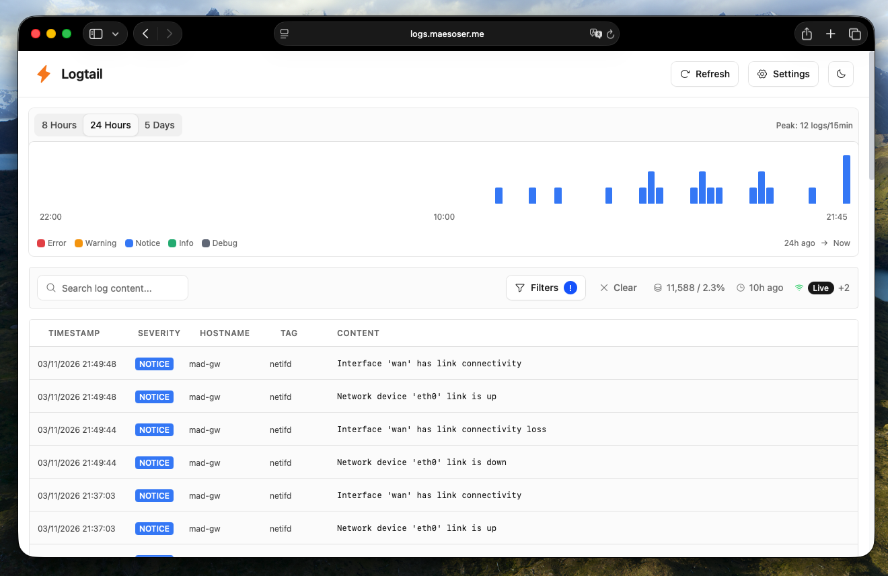

# Logtail

_The uncomplicated logs dashboard for your homelab._



An opinionated log ingestion and visualization application with a Go backend and React frontend.

## But why?

I built this because I didn't find funny anymore to have a production ready setup at home. It was fun to have Loki, Grafana and a full ELK stack at home to learn, but in the end, specially when you begin selfhosting things that are really important, you just want tools that work.

I replaced Grafana with Beszel and really wanted something similar for my logs. I didn't find anything that could fit _just_ my needs so I built one.

Logtail aggregates logs in a circular buffer in memory. In the end, RAM it's so cheap, right? And I don't either have thousands of logs per second or have any regulatory requirement to keep the logs for 6 months so just with 64Mb I have plenty of space for more than two weeks of logs. And I can make backups just in case!

## Features

- Real-time log streaming via WebSocket
- Filterable and paginated log queries
- 24-hour histogram and buffer statistics
- Thread-safe circular buffer storage
- Single binary with embedded web UI

## How to run it

You need to install logfwrd and configure logfwrd to send the logs to logtail's ingestion endpoint. Additionally, you could use a secret token to make sure no spurious messages are ingested in your aggregated logs.

### Using the binary

```bash
./logtail                                    # Run (default port 8080)
./logtail -port 9000 -buffer-size 50000     # Custom config
./logtail --config /etc/logtail.yml         # With config file
```

### Using Docker

```bash
docker build -t logtail .
docker run -p 8080:8080 logtail
```

## API Endpoints

| Method | Path | Description |
|--------|------|-------------|
| POST | `/ingest` | Accept gzip-compressed JSONL logs |
| GET | `/api/logs` | Paginated, filterable log queries |
| GET | `/api/stats` | 24-hour histogram and buffer stats |
| GET | `/api/values?field=X` | Unique values for filter dropdowns |
| GET | `/ws` | WebSocket for real-time streaming |
| GET | `/health` | Health check with buffer stats |

## Log Schema

Logs are ingested as JSONL (one JSON object per line):

```json
{
  "client": "string",
  "facility": "string",
  "hostname": "string",
  "priority": 0,
  "severity": 0,
  "tag": "string",
  "timestamp": "RFC3339",
  "content": "string"
}
```

## Development

### Backend (Go)

```bash
go build -o logtail ./cmd/logtail           # Build
go test ./...                                # Run tests
go test -v -race ./...                      # Tests with race detection
go vet ./...                                # Lint
```

### Frontend (web/)

```bash
cd web
npm install                  # Install dependencies
npm run dev                  # Development server (proxies to localhost:8080)
npm run build                # Production build (outputs to web/dist/)
npm run lint                 # Lint
npx tsc --noEmit            # Type check
```

### Full Stack Development

```bash
# Terminal 1: Backend with dev mode
go run ./cmd/logtail -dev

# Terminal 2: Frontend dev server
cd web && npm run dev

# Generate test logs
./scripts/simulate-logs.sh -n 100           # Send 100 logs
./scripts/simulate-logs.sh                  # Continuous mode
```

## But why don't you built a login page?

I use Cloudflare Access to protect the access to the dashboard.

